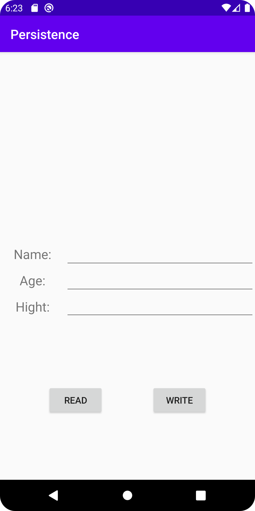
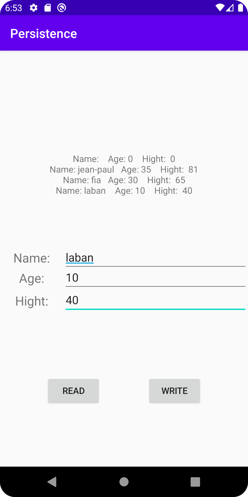

# Rapport Assignment 7: SQLite

I denna uppgift skulle man skapa en enklare databas med hjälp av *SQLite*. Det gjordes med hjälp av koden nedan som skapats som en egen __class__, notera att den extendar *SQLiteOpenHelper*.
Databasen i sig skapas i metoden `onCreate()`, där Tabellen först får ett namn, sedan anges attributen _id, namn, age, hight. Dessa blir de kolumner som finns i tabellen.

```java
public class AssignmentDB extends SQLiteOpenHelper {

    private static final String DATABASE_NAME = "person.db";                        // måste vara static för att fungera
    private static final int DATABASE_VERSION = 1;                                  // höjs med 1 varje gång något ändras i databasen (onUpgrade() anropas)

    public static final String TABLE_PEOPLE = "people";
    public static final String COLUMN_ID = "_id";
    public static final String COLUMN_NAMN = "namn";
    public static final String COLUMN_AGE = "age";
    public static final String COLUMN_HIGHT = "hight";

    public AssignmentDB(@Nullable Context context) {            // attributen name, factory och version, togs bort 
        super(context, DATABASE_NAME, null, DATABASE_VERSION);
    }


    @Override
    public void onCreate(SQLiteDatabase db) {                          //// refraktor och sedan introduce constant användes för att associera namnen på kolumnerna med en konstant.
        db.execSQL("CREATE TABLE " + TABLE_PEOPLE + " (" +             // här skappas databasen 
                    COLUMN_ID + " INTEGER PRIMARY KEY, " +
                    COLUMN_NAMN + " TEXT, " +
                    COLUMN_AGE + " INTEGER, " +
                    COLUMN_HIGHT + " INTEGER )");
    }

    @Override
    public void onUpgrade(SQLiteDatabase db, int oldVersion, int newVersion) {

    }
}
```

För att möjliggöra registrering av information till databasen skapades en layout i *activity_main* enligt nedan, där varje rad med `EditText` widgets motsvarar en Kolumn i databasen.



I main klassen skapas alla variabler som associeras med de widgets som finns i layouten. Sedan de klasser som behövs för att möjliggöra arbete med databasen, d.v.s. SQLiteDatabase och AssignmentDB klass som skrevs i början.
För att göra koden mer lättläslig skapades två metoder, readFromDB() och addToDB(). Dessa anropas vid "klick" på de knappar som finns i layouten.

```java
public class MainActivity extends AppCompatActivity {

    private Button readButton;
    private Button writeButton;
    private EditText insertName;
    private EditText insertAge;
    private EditText insertHight;
    private TextView textToDB;
    private SQLiteDatabase db;                          //  en instanse av klasserna SQliteDatabase och den egenskapade klassen skapas
    private AssignmentDB databaseHelper;                //  (Det är här databasen skapas)

    @Override
    protected void onCreate(Bundle savedInstanceState) {
        super.onCreate(savedInstanceState);
        setContentView(R.layout.activity_main);

        databaseHelper = new AssignmentDB(this);                     // Databas skapad
        db = databaseHelper.getWritableDatabase();                   // möjliggör ändringar i databasen

        readButton = findViewById(R.id.Read_Button);
        writeButton = findViewById(R.id.Write_Button);

        insertName = findViewById(R.id.database_insert_Name);
        insertAge = findViewById(R.id.database_insert_Age);
        insertHight = findViewById(R.id.database_insert_Hight);

        textToDB = findViewById(R.id.texttodb);

        readButton.setOnClickListener(new View.OnClickListener() {        // Leder till metoden som möjliggör läsande från databasen
            @Override
            public void onClick(View v) {
                readFromDB();
            }
        });

        writeButton.setOnClickListener(new View.OnClickListener() {        // registrarar klick, och skickar vidare till metoden som skickar den
                                                                           // lästa informationen till databasen
            @Override
            public void onClick(View v) {
                addToDB();
            }
        });

    }
```

Klickar användaren på *WRITE* skickas de till metoden nedan, här registreras de värden som finns skrivna i EditText rutorna i objektet values, sist returneras värdet till databasen.

```java
private long addToDB(){                // sätter in de värden som finns skrivna i EditText rutorna vid klick.

        ContentValues values = new ContentValues();
        values.put(AssignmentDB.COLUMN_NAMN, insertName.getText().toString());      //
        values.put(AssignmentDB.COLUMN_AGE, insertAge.getText().toString());        // varje EditText widgets innehåll registreras i __values__ indeviduelt
        values.put(AssignmentDB.COLUMN_HIGHT, insertHight.getText().toString());    //

        return db.insert(databaseHelper.TABLE_PEOPLE, null, values);

    }
```

klickar de på "READ" skickas de istället till denna metod, en mer ingående förklaring för vad koden gör finns angivna som kommentarer i koden. Kortfattat så registreras informationen ur varje rad som en Strängvariabel i en array, dessa variabler sätts sedan ihop till en enda lång sträng som slutligen skickas till textViewn

````java
private void readFromDB(){          // Tar de värden som finns i tabellen och skriver ut dem i TextViewn

        Cursor cursor = databaseHelper.getReadableDatabase().query(AssignmentDB.TABLE_PEOPLE, null, null,null, null, null, null );
        ArrayList<String> tempTableInfoArray = new ArrayList<>();                                              // används för att samla informationen från tabellen 
        String tempTableInfo = "";                                                                             // all information som finns i arrayen kommer skrivas in i denna variabel som en enda läng sträng

        while (cursor.moveToNext()){                                                                           // så länge det finns en ny rad i tabellen fortsätter loopen                                           
          String name = cursor.getString(cursor.getColumnIndexOrThrow(AssignmentDB.COLUMN_NAMN));               //
          int age     = cursor.getInt(cursor.getColumnIndexOrThrow(AssignmentDB.COLUMN_AGE));                   // värdena i varje rad registreras indeviduelt. dessa sparas i variabler
          int hight   =  cursor.getInt(cursor.getColumnIndexOrThrow(AssignmentDB.COLUMN_HIGHT));                //
          tempTableInfoArray.add("Name: " + name + "   Age: " + age + "    Hight:  " + hight  +"\n");           // en sträng skapas av de innehåll som registrerats i variablerna (varje rad i tabelen kommer få en egen rad i texten då '\n' används)
        }


        for (int j = 0; j < tempTableInfoArray.size(); j++) {           
            tempTableInfo += tempTableInfoArray.get(j).toString();      // innehållet i varje "__låda__" *Arrayen* sätts till i `String` variabeln 
        }

        textToDB.setText(tempTableInfo);                                // Texten i variabeln som skapats i raden ovan, skickas till TextViewn 
        cursor.close();
    }
````





